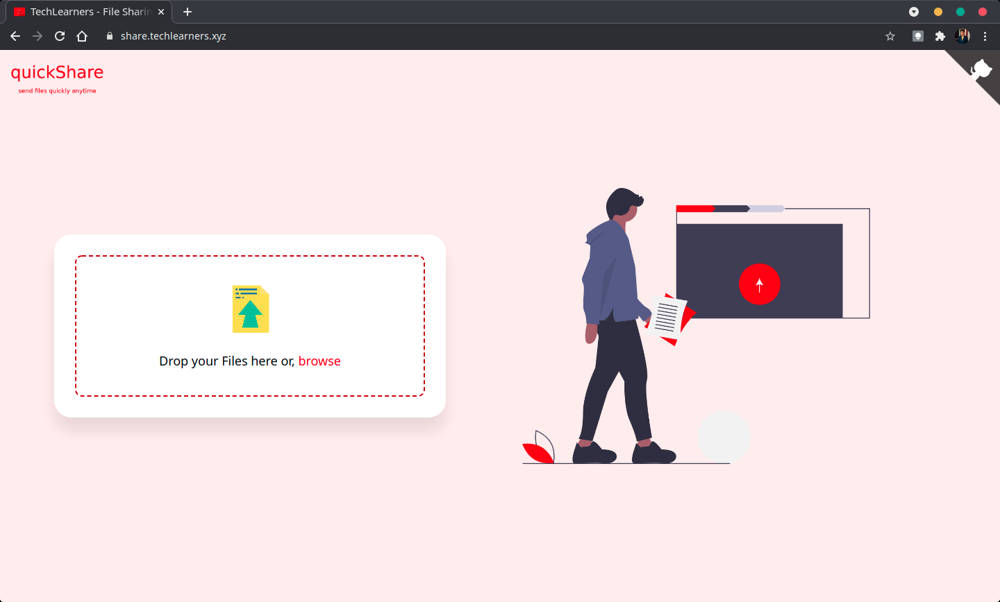
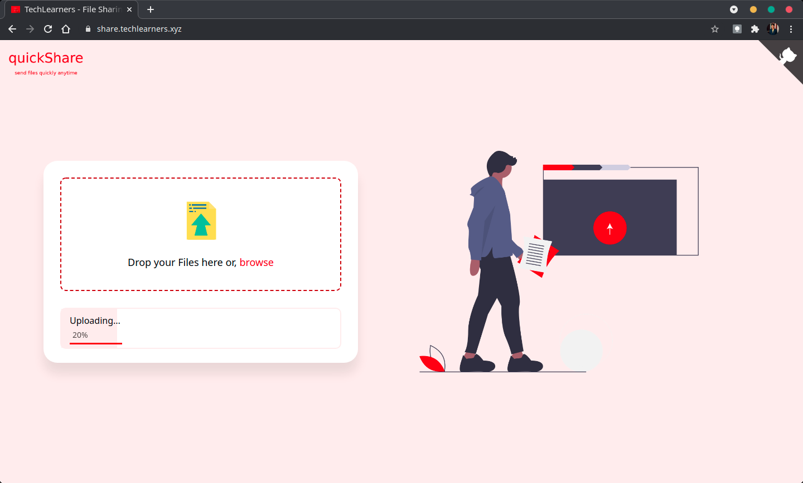
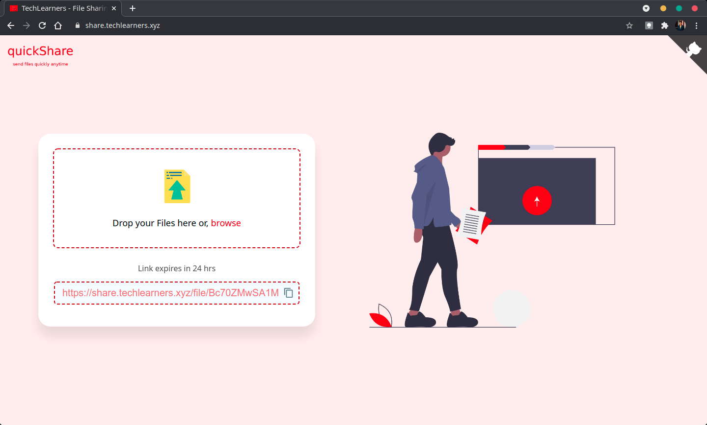
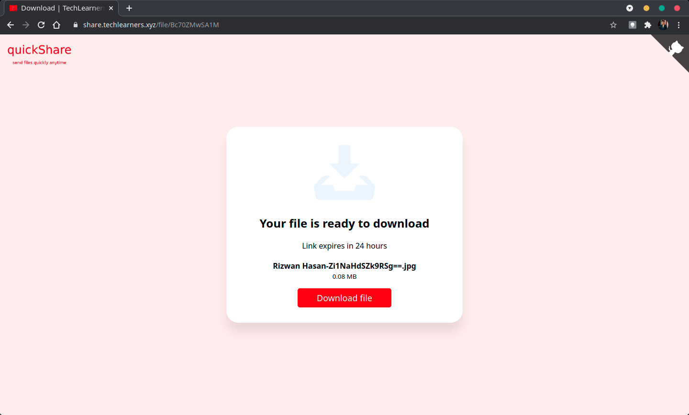

# File Sharing WebApp

A File Sharing web app built using NodeJS and also Azure Function, Azure Blob Storage, and Redis.

## Screenshot

## Contributing

Pull requests are welcome. For major changes, please open an issue first to discuss what you would like to change.

## License

[MIT](LICENSE)
